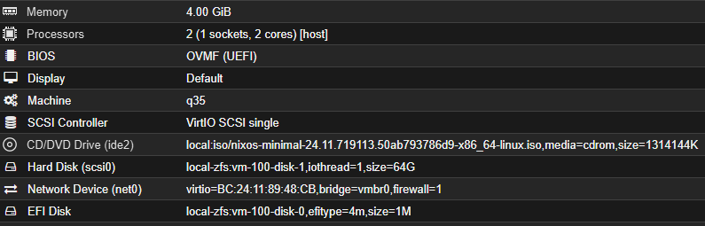
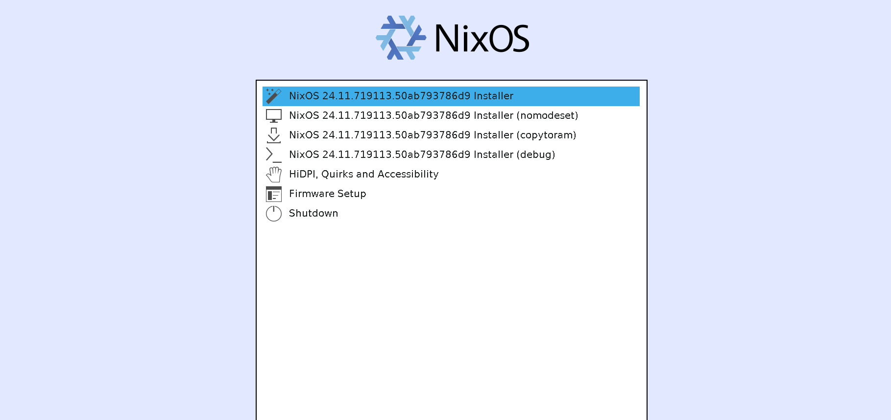
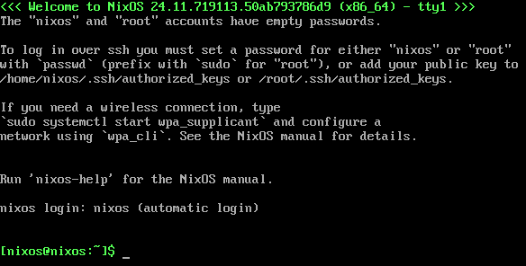
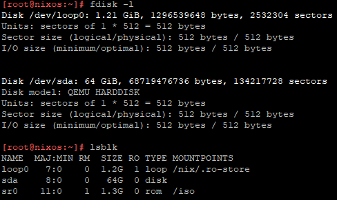
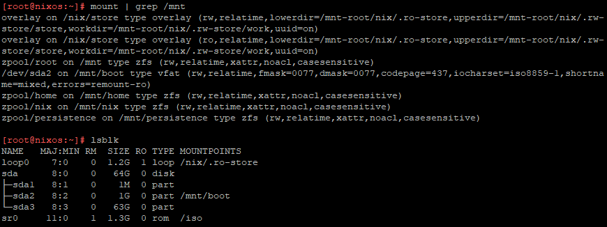
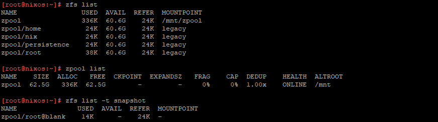

# NixOS Installation

<!-- TODO: improve this paragraph -->
In particular, this guide refers to NixOS 24.11 (Vicuna). It is meant to be used as a server
that contains docker containers. It can be installed both on bare-metal and as a VM (for example proxmox).

<!-- TODO: improve this paragraph -->
## Preparation

1. Download the minimal ISO image for NixOS 24.11 (Vicuna) from the [official link](https://releases.nixos.org/nixos/24.11/nixos-24.11.719113.50ab793786d9/nixos-minimal-24.11.719113.50ab793786d9-x86_64-linux.iso).

2. Create a bootable USB drive that will be used for installation Installation with minimal installer.

3. Boot into the nixos minimal installer.

## Proxmox Preparation

TODO:



## Installation





### 1. (Optional) Switch keyboard layout

Switch keyboard layout to your preferred one (in my case it's italian)

```shell
$ sudo loadkeys it
```

<!--
### 3. (Optional) WIFI
> $ ifconfig # to check the NIC \
> $ wpa_passphrase "\$YOUR_SSID" "\$YOUR_PASSWORD" > /tmp/wpa_supplicant.conf \
> $ wpa_supplicant -B -i interface_name -c /tmp/wpa_supplicant.conf
-->

### 2. Setup root password

TODO: brief description

```shell
$ sudo passwd root
<temporary root password>
$ ip addr
```

## Partition manually (UEFI)

https://nlewo.github.io/nixos-manual-sphinx/installation/installing.xml.html

```terminal
parted /dev/sdX -- mklabel gpt
parted /dev/sda -- mkpart ESP fat32 1MiB 1GiB
parted /dev/sda -- set 1 boot on

parted /dev/sda -- mkpart primary 1GiB -1MiB

mkfs.ext4 -L nixos /dev/sda2
mkfs.fat -F 32 -n boot /dev/sda1


mkpart ESP fat32 1MiB 1GiB
set 1 esp on
mkpart EXT4 1GiB -1MiB
print
quit

mkfs.fat -F32 -n ESP /dev/sdX
```

## Install Disko

Source - https://nixos.asia/en/nixos-install-disko
- https://github.com/nix-community/disko

Identify wether the system is UEFI or BIOS (legacy) by checking if `/sys/firmware/efi` exists means system uses UEFI.

Identify the disk where to install the system by using `fdisk -l` and `lsblk`.



Retrieve the disk configuration to a temporary location, calling it "disko.nix" (we will use it later):

```shell
curl -o /home/nixos/disko.nix https://raw.githubusercontent.com/iamryusei/nixos-server-config/refs/heads/master/nixos/disko.nix
```

Then edit the disko config locally and change /dev/sdx to target disk (usually /dev/sda)

```shell
nano /home/nixos/disko.nix
```

The disko flake provides an app that will take our partitioning scheme defined in Nix file above, partition the specified disk device and mount it at /mnt. We want this to happen prior to installing NixOS. Let’s do that now:

```shell
nix --experimental-features "nix-command flakes" run github:nix-community/disko/latest -- --mode destroy,format,mount /home/nixos/disko.nix
```

check if everything is ok with `mount | grep /mnt` `lsblk` `zfs list` `zpool list` `zfs list -t snapshot` should see zroot/root mounted on /mnt, and other ...




# PROVA SEMPLICE

```shell
mkdir -p /mnt/etc/nixos
cd /mnt/etc/nixos
nixos-generate-config --no-filesystems --root /mnt
mv /home/nixos/disko.nix /mnt/etc/nixos
curl -o flake.nix https://raw.githubusercontent.com/iamryusei/nixos-server-config/refs/heads/master/nixos/flake.nix
curl -o configuration.nix https://raw.githubusercontent.com/iamryusei/nixos-server-config/refs/heads/master/nixos/configuration.nix
curl -o impermanence.nix https://raw.githubusercontent.com/iamryusei/nixos-server-config/refs/heads/master/nixos/impermanence.nix
```

<!-- TODO: o addirittura git clone ??? -->

set networking.hostId to value of -> head -c 8 /etc/machine-id

```shell
sed -i "s/\\\${hostId}/$(head -c 8 /etc/machine-id)/g" /mnt/etc/nixos/configuration.nix
```

1. Let’s check that our final configuration is correct by using nix repl. In particular, we test the fileSystems set by disko:

> $ cd /mnt/etc/nixos \
> $ nix --experimental-features "nix-command flakes" flake lock

// # Start repl
> $ nix --experimental-features "nix-command flakes" repl \
> $ :lf . \
> $ outputs.nixosConfigurations.nixos-server.config.fileSystems \
> $ outputs.nixosConfigurations.nixos-server.config.fileSystems."/" \
> $ outputs.nixosConfigurations.nixos-server.config.fileSystems."/boot" \
> $ outputs.nixosConfigurations.nixos-server.config.fileSystems."/nix" \
> $ outputs.nixosConfigurations.nixos-server.config.fileSystems."/persistence" \
> $ :q

FINALLY, INSTALL!

> $ cd / \
> $ nixos-install --root /mnt --flake '/mnt/etc/nixos#nixos-server' --show-trace -v
>

Generate initial NixOS configuration
With the disk partitioned, we are ready to follow the usual NixOS installation process. The first step is to generate the initial NixOS configuration under /mnt.

> $ mkdir -p /mnt/etc/nixos \
> $ mkdir -p /mnt/persistence/etc/nixos \
> $ mount --bind /mnt/persistence/etc/nixos /mnt/etc/nixos
> $ nixos-generate-config --no-filesystems --root /mnt \

now /mnt/etc/nixos should contain configuration.nix and hardware-configuration.nix

> $ cd /mnt/etc/nixos \
> $ mv /home/nixos/disko.nix /mnt/etc/nixos \
> $ curl -o flake.nix https://raw.githubusercontent.com/iamryusei/nixos-server-config/refs/heads/master/nixos/flake.nix \
> $ curl -o configuration.nix https://raw.githubusercontent.com/iamryusei/nixos-server-config/refs/heads/master/nixos/configuration.nix \
> $ curl -o impermanence.nix https://raw.githubusercontent.com/iamryusei/nixos-server-config/refs/heads/master/nixos/impermanence.nix \

# NOTE: You will be prompted to set the root password at this point.

> $ shutdown now

remove drive

reboot

